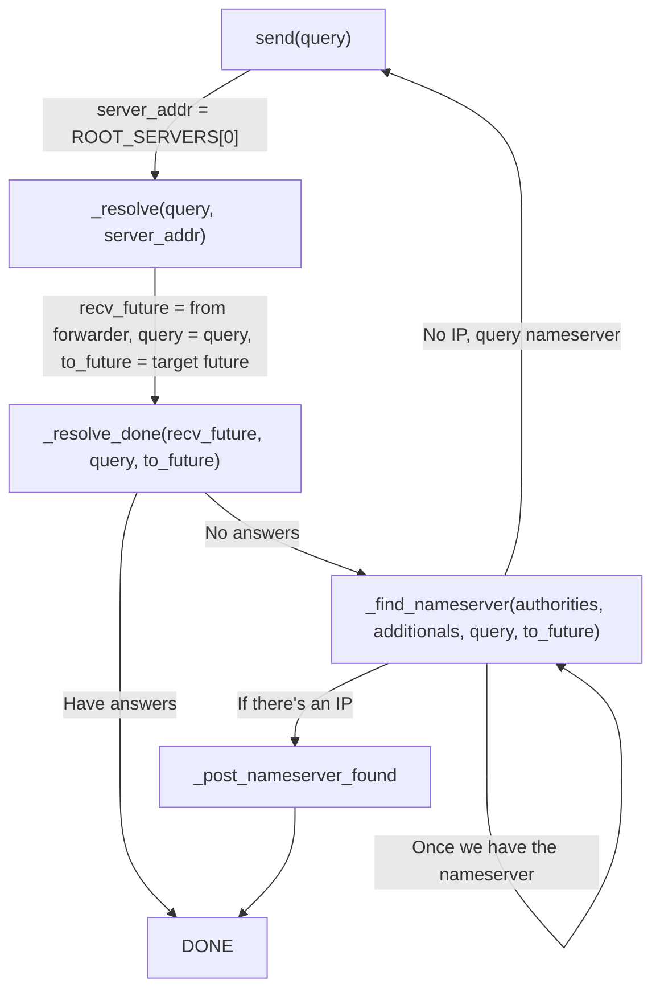

```mermaid
graph TD;
    send["send(query)"]
    send --> |"server_addr = ROOT_SERVERS[0]"| _resolve["_resolve(query, server_addr)"]
    _resolve --> |"recv_future = from forwarder, query = query, to_future = target future"| _resolve_done["_resolve_done(recv_future, query, to_future)"]
    _resolve_done --> |"Have answers"| done["DONE"]
    _resolve_done --> |"No answers"| _find_nameserver["_find_nameserver(authorities, additionals, query, to_future)"]
    _find_nameserver --> |"If there's an IP"| _post_nameserver_found
    _find_nameserver --> |"No IP, query nameserver"| send
    _find_nameserver --> |"Once we have the nameserver"| _find_nameserver
    _post_nameserver_found --> done
```